# Awesome Superpixel Tokenization

## What is a Superpixel?

Modern images frequently exceed resolutions of $1000 \times 1000$ pixels, leading to over $1$ million data points, which presents a significant dimensionality challenge for image processing. The prevailing deep learning approach, as seen in models like the Vision Transformer (ViT), involves partitioning an image into non-overlapping **patches**. However, when using these standard square patches as tokens, a single token can inadvertently encompass multiple distinct visual concepts—for example, an eye and a patch of fur—thereby violating the fundamental principle of semantic consistency inherent in text tokenization.

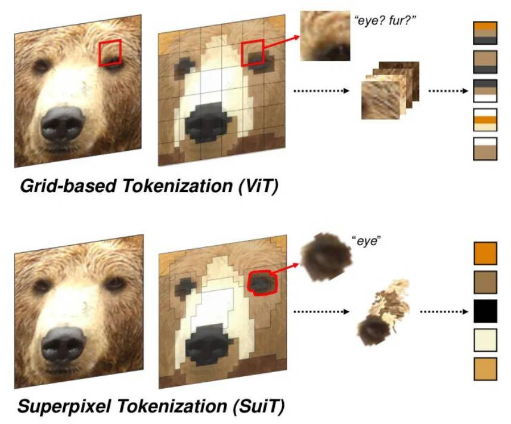

A **superpixel** offers an adaptive, content-aware alternative to fixed patches, often described as a Superpixel Representation: Bridging Pixel and Patch Approaches. Conceptually, a superpixel is an aggregation of adjacent pixels that share similar characteristics (e.g., color, texture, or category) into a single, more representative large **element**. This new element then serves as the fundamental unit for subsequent image processing algorithms. This approach offers dual benefits: first, it drastically reduces dimensionality; second, it naturally filters out isolated, anomalous pixel values. Traditional superpixel segmentation algorithms group pixels based on local characteristics to form these cohesive regions.

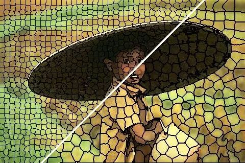

To objectively compare the performance of the numerous superpixel algorithms available, the field generally relies on three key metrics:

1.  **Undersegmentation Error (UE)**: As shown in the figure below, the white shape represents an object in the original image, the red lines are the superpixel boundaries, and the pink area denotes the region of undersegmentation. Evidently, a larger pink area (higher error) indicates poorer performance, as the superpixels fail to accurately delineate the object boundary.

    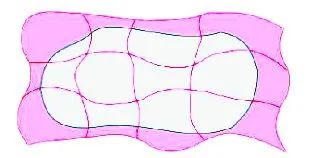

2.  **Boundary Recall (BR)**: In the figure below, the black dashed and solid lines represent the ground-truth object boundaries, and the red lines are the superpixel boundaries. A high-performing superpixel algorithm should accurately cover the object's outline. With a small tolerance buffer (pink area), the algorithm is considered superior if its superpixel edges (solid black lines) cover a greater portion of the true object boundaries (solid black lines).

    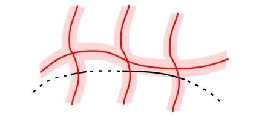

3.  **Compactness Score**: This metric quantifies how "compact" or regular the shape of the superpixels is. As illustrated, a visually tighter and more circular superpixel shape is generally preferred.

    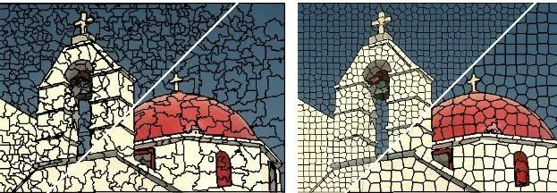

---

## Classical Superpixel Algorithms

### 1. Seed-Based Initialization (SLIC)
The Simple Linear Iterative Clustering (SLIC) algorithm employs a straightforward, greedy clustering approach. Initially, cluster centers (seed pixels) are evenly distributed across the image, which fundamentally determines the approximate number of superpixels. In each iterative step, a seed pixel aggregates surrounding pixels that exhibit feature similarity, eventually forming the superpixels.

> **Note:** You can explore the effectiveness of this segmentation by running `examples/SLIC.py`.

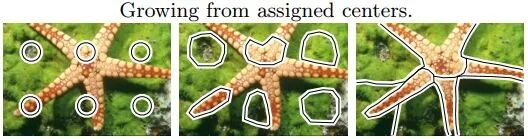

### 2. Rectangular Region Initialization (SEEDS)
The Superpixels Extracted via Energy-Driven Sampling (SEEDS) algorithm begins by dividing the image into many uniform rectangular regions, which serve as the initial superpixels. Through subsequent iterative steps, the boundaries of these superpixels are continually refined and adjusted until the energy function converges.

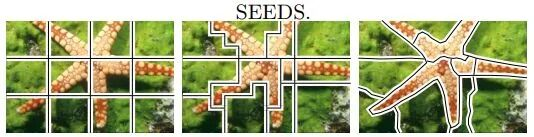

---

## Superpixel Tokenizer Literature Review

> **Core Focus:** Thoroughly study the training and model code for **SuiT**, **SPIN**, and **SPoT**!

### [SSN (arXiv:1807.10174)](https://arxiv.org/pdf/1807.10174)
SSN (Superpixel Sampling Network) is a seminal work that integrates a differentiable variant of SLIC into Convolutional Neural Networks (CNNs), enabling **end-to-end training**. This pioneering approach is highly recommended for study.

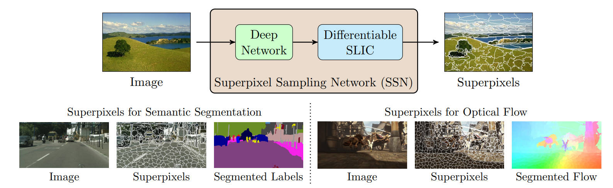

### [SViT (arXiv:2211.11167)](https://arxiv.org/pdf/2211.11167)
SViT (Superpixel Vision Transformer) clusters image tokens into "SuperTokens." The key limitation is that this clustering process is non-differentiable (gradient-free!). Consequently, the network cannot learn from clustering errors, hindering its ability to fully optimize the superpixel formation process.

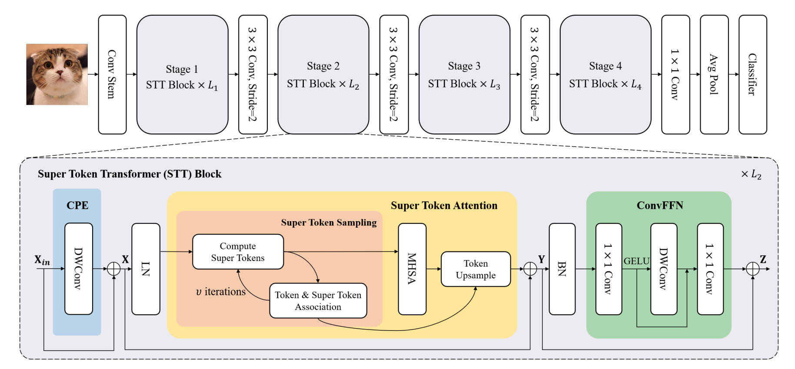

### [SPIN (ICCV 2023)](https://openaccess.thecvf.com/content/ICCV2023/papers/Zhang_Lightweight_Image_Super-Resolution_with_Superpixel_Token_Interaction_ICCV_2023_paper.pdf)
SPIN (Superpixel Token Interaction Network) applies superpixels to the task of image Super-Resolution. The training code is fully open-source and an excellent reference.

> **Code:** [https://github.com/ArcticHare105/SPIN](https://github.com/ArcticHare105/SPIN)

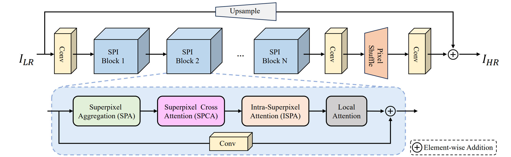

1.  **Superpixel Aggregation Module (SPA)**:
    * Uses a **soft $K$-means-based** superpixel clustering algorithm.
    * The aggregation process is an Expectation-Maximization-like procedure with $T$ iterations.
    * Initialization: Superpixel features are initialized by averaging features within a regular grid.
    * Iteration: The association matrix $A$ is iteratively calculated. Critically, aggregation only computes the association map for features to their **nine surrounding superpixels**, ensuring locality and high computational/memory efficiency.

    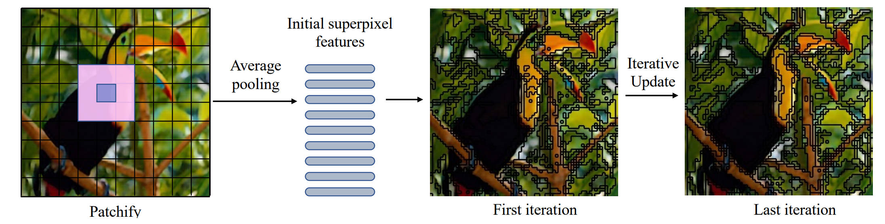

2.  **Superpixel Cross-Attention Module (SPCA)**:
    * Since superpixels primarily capture local features, they may lack the capacity to model long-range dependencies.
    * **Aggregation:** The module uses a self-attention paradigm where superpixels serve as proxies for individual pixel features, facilitating enhanced long-range interactions (pixel $\times$ association matrix $A$ = superpixel features).
    * **Distribution:** To propagate the aggregated information back to the pixels, the updated superpixel features are used as the Value matrix, and Cross-Attention maps them back to the individual pixels.

    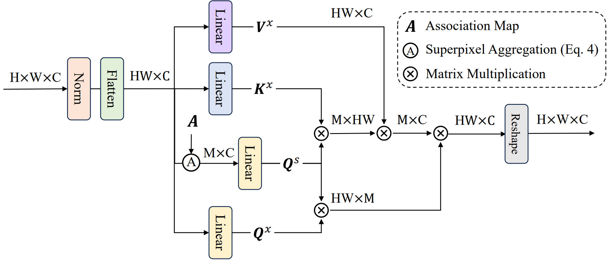

3.  **Intra-Superpixel Attention Module (ISPA)**:
    * This module leverages the complementarity of similar pixels **within the same superpixel** to improve Super-Resolution quality, guided by the association map.
    * **Challenge:** Different superpixels contain varying numbers of pixels, complicating parallel processing and leading to unexpected memory consumption.
    * **Solution:** As depicted in Figure 5, only the **top $N$ most similar pixels** are selected for each superpixel.
    * **Handling Unselected Pixels:** Any "unselected" (ignored) pixels are updated using the Value matrix $V$ and then integrated with the pixels updated through the intra-superpixel interaction.

    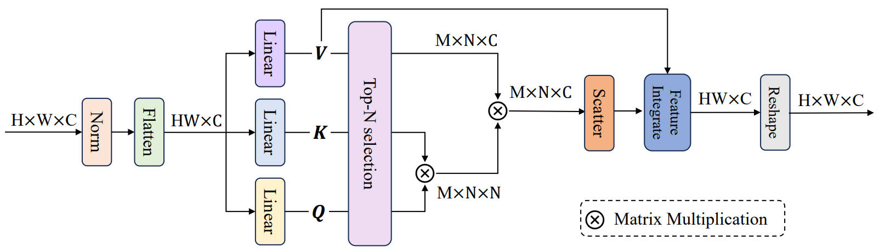

### [SPiT (ECCV 2024)](https://arxiv.org/pdf/2408.07680)
SPiT (Superpixel Tokenization) focuses on **decoupling** the Patch Embedding process in Vision Transformers (ViT) into a flexible, content-aware, and modular system. Although the paper is complex, it is highly instructive (model code only).

The super-pixel embedding layer $g$ consists of three pluggable components:
* $\mathbf{\tau}$ (Tokenizer): Responsible for segmenting the image into irregular, semantically consistent superpixel regions.
* $\mathbf{\phi}$ (Feature Extractor): Extracts fixed-dimension features from these irregular regions, making them compatible with the ViT backbone.
* $\mathbf{\gamma}$ (Embedder): Maps the extracted features into the necessary embedding space for the ViT backbone (typically a learnable linear layer).

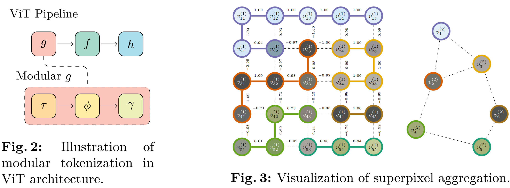

1.  **Partitioning and Tokenization**:
    * SPiT proposes a novel **Hierarchical Superpixel** approach based on a graph structure, which is highly parallelizable and suitable for **On-line Tokenization**.
    * The method involves fully parallel aggregation of batch-image graphs at every step, incorporating regularization on superpixel size and compactness to dynamically adapt to image complexity.
    * **Superpixel Graphs:** The image is initially a grid graph $G^{(0)}$, with each pixel as a node $v \in V^{(0)}$. Superpixels are connected subsets $S$. A hierarchy $\mathcal{H} = (\pi^{(t)})^T_{t=0}$ is generated through graph aggregation.
    * **Weight Function ($w_{\xi}(u, v)$):** Defines which neighboring superpixels should merge, with a dual objective:
        1.  **Non-Self-Loop Edges ($u \neq v$):** Uses a similarity function $\mathrm{sim}$ to measure feature similarity between neighbors (based on mean pixel features $\mu$).
        2.  **Self-Loop Edges ($u = v$):** Regularizes superpixel size. The weight is proportional to the standardized difference between the superpixel's size $|\pi^{(t)}_u|$ and the layer's average size $\mu_{|\pi|}^{(t)}$. This limits the variance in region size.
        $$w_\xi (u, v) = \begin {cases} \mathrm {sim}\Big (\mu _\xi ^{(t)}(u), \mu _\xi ^{(t)}(v)\Big ), & \text {for $u \neq v$;} \\ \Big (\lvert \pi ^{(t)}_u \rvert - \mu _{\lvert \pi \rvert }^{(t)}\Big ) / \sigma _{\lvert \pi \rvert }^{(t)}, & \text {otherwise.} \end {cases}$$
        * **Compactness Regularization:** An optional compactness density $\delta_\infty(u, v)$ (based on bounding-box perimeter $per_\infty$, encouraging compact shapes) can be incorporated via hyperparameter $\lambda$.
    * **Update Rule (Edge Contraction):** A greedy, parallel update rule:
        1.  Each superpixel $v$ connects to its neighbor $u$ with the highest edge weight (including the self-loop).
        2.  The connected components $\hat{\mathfrak{N}}_+^{(t)}(v)$ are computed via transitive closure to determine the new, larger superpixel $v^{(t+1)}$.
        3.  The new superpixel $\pi^{(t+1)}_v$ is the union of all old superpixels $\pi^{(t)}_u$ selected for merging, ensuring connectivity in the new partition.

2.  **Feature Extraction with Irregular Patches ($\phi$)**: Given the irregular nature of superpixels, a specially designed $\phi$ is needed to extract fixed-dimension features. The final feature $\hat{\xi}_n$ is a concatenation: $\hat{\xi}_n = [\hat{\xi}^{(col)}_n, \hat{\xi}^{(pos)}_n, \hat{\xi}^{(grad)}_n]$.
    * **Positional Encoding**: SPiT proposes a **scale- and shape-invariant positional encoding** for irregular shapes. It computes a joint histogram of all pixel coordinates within the superpixel $S_n$, encoded with a Gaussian kernel $K_\sigma$. This encodes not just the superpixel's location, but also its shape and scale.
    * **Color Features**: Aims to capture raw intensity information in a fixed dimension ($\beta \times \beta$). Bilinear interpolation is used to uniformly rescale the raw pixel information within the superpixel's bounding box to a fixed $\beta \times \beta$ resolution, masked to exclude outside information. Result: fixed-dimension RGB features $\hat{\xi}^{(col)} \in \mathbb{R}^{3\beta^2}$.
    * **Texture Features**: Introduced (proven important in ablation studies) to capture local structure and compensate for potential interpolation loss. Method: Uses the Scharr gradient operator to extract image gradient (texture) information. Encoding: Similar to position encoding, a joint histogram is constructed for the gradient information within the superpixel, resulting in $\hat{\xi}^{(grad)} \in \mathbb{R}^{\beta^2}$.

### [SuiT (arXiv:2412.04680)](https://arxiv.org/pdf/2412.04680)
SuiT (Superpixel-aware Unified Image Transformer) is an improvement on SPiT that aims to construct more semantically independent visual concept tokens for ViT tasks (understanding and perception). It replaces the ViT's fixed `patchify` process with superpixel clustering, generating pixel-embeddings which are then aggregated into superpixel tokens and seamlessly fed into the ViT backbone.

> **Code:** [https://github.com/jangsoohyuk/SuiT/tree/main](https://github.com/jangsoohyuk/SuiT/tree/main)

SuiT successfully integrates superpixel tokens into the ViT backbone, enabling **Adaptive Inference**. The token count is no longer fixed but can be dynamically adjusted based on image complexity and computational budget, achieving more efficient computation (maintaining or exceeding DeiT performance with fewer tokens). $K$-means analysis shows that SuiT's tokens group based on semantic content (e.g., "duck," "water") rather than fixed positions, confirming their semantic integrity.

1.  **Pixel-level Embedding**:
    * **Local Features**: A simple Conv Block (e.g., initial ResNet layer) extracts high-dimensional local features from the raw RGB space.
    * **Positional Features**: Due to the high granularity and dynamic nature of superpixel positions, SuiT employs a **parameter-efficient, learnable-frequency sinusoidal positional encoding** instead of fixed learned embeddings to efficiently encode complex spatial information.

    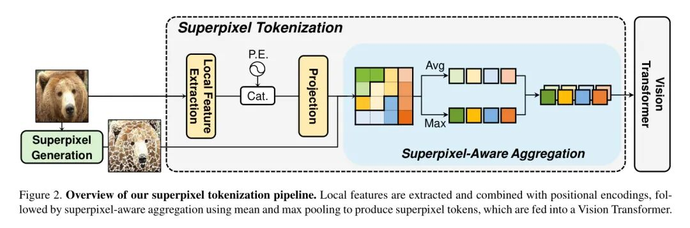

2.  **Superpixel-aware Aggregation**: Once the pixel-level embedding $F$ is ready, SuiT uses the superpixel index map $I$ to aggregate each superpixel $C_k$ into a fixed-dimension Token $z^{(k)}$:
    * **Dual Pooling**: To capture complementary information and remove size irregularities, SuiT concatenates the **Average Pooling** and **Max Pooling** of all pixel embeddings within $C_k$.
        * Average Pooling ($z_{avg}$): Captures the superpixel's overall feature.
        * Max Pooling ($z_{max}$): Captures the most salient feature within the superpixel.

    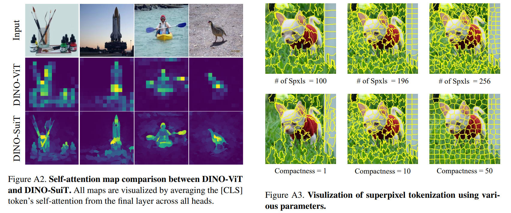
    * **Superpixel Algorithm**: FastSLIC (a faster implementation of SLIC) is used with a compactness parameter of $10$, a maximum of $10$ iterations, and a configuration for a **maximum** of $196$ superpixels. **Crucially, the actual number of generated superpixels is dynamic and image-dependent.** (e.g., the average count on the ImageNet-1K validation set is $191.9 \pm 6.0$).

### [SPAM (arXiv:2509.12791)](https://arxiv.org/abs/2509.12791)
SPAM (Superpixel-aware Mask Attention Model) is an improvement over SSN, introducing a spatial clustering prior derived from the Segment Anything Model (SAM). It is generally considered a more straightforward (naive) approach but offers fully open-sourced code.

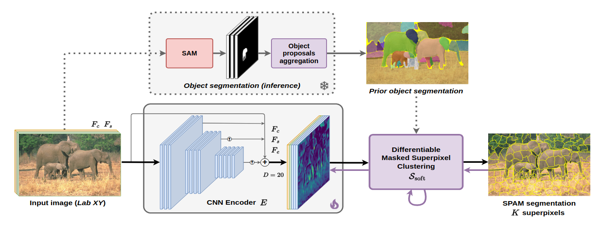

### [SPoT (arXiv:2507.01654)](https://arxiv.org/pdf/2507.01654)
SPoT (Superpixel Tokenization) focuses on overcoming the limitations of the fixed-grid patchification in ViT, especially when pursuing **sparsity**—representing image information with the minimum number of tokens.
* **Issues with Fixed Grid:** (1) **Redundancy and Feature Splitting:** As shown in Figure 2, a salient region lying on the boundary of four fixed patches forces the model to select all four, leading to token redundancy and wasted computation. (2) **Optimization Difficulty:** Fixed discrete token positions turn the search for an optimal sparse subset into an **NP-hard** combinatorial optimization problem, which cannot be solved efficiently with gradient descent.

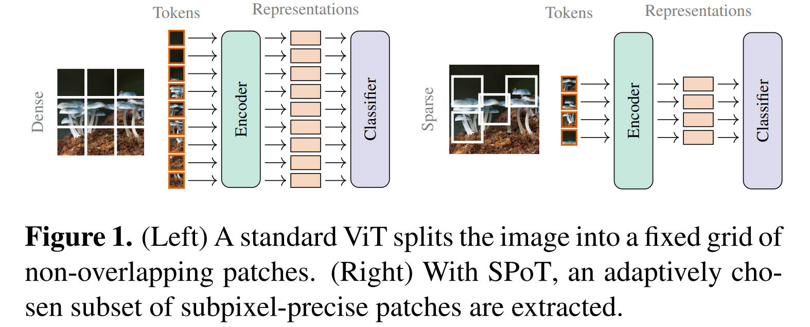

SPoT's core innovation is shifting token placement from a fixed, discrete grid ($\Omega_{\text{grid}}$) to a **continuous, sub-pixel space** ($\Omega_{\text{subpix}}$).

1.  **SPoT Mechanism: Differentiable Feature Extraction at Continuous Locations**:
    * SPoT allows a fixed-size feature window (e.g., $16 \times 16$) to extract features at **any continuous coordinate $(h, w)$** on the image.
    * **Bilinear Interpolation ($q$):** Introduced to sample pixel data at non-integer (sub-pixel) locations.
    * **Differentiability:** The critical advantage is that bilinear interpolation is differentiable (except at pixel boundaries). This allows the loss gradient to cleanly backpropagate to the token coordinate positions $\{s_1, \dots, s_m\}$.
    * This transforms the difficult discrete subset selection problem into a continuous, **differentiable optimization problem**, solvable using standard, efficient gradient descent to find optimal token locations.

    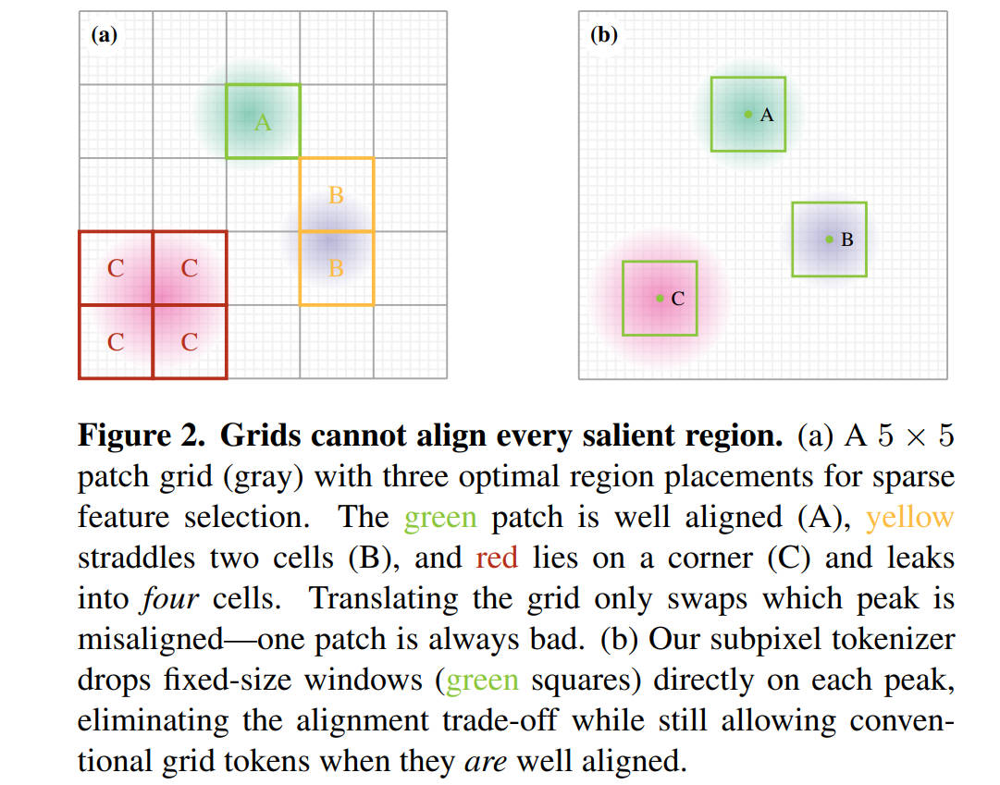

2.  **Spatial Priors**: Without a fixed grid for guidance, SPoT requires various **Spatial Priors** to initialize the token positions $S^0$:
    * **Uniform / Gaussian:** Random sampling; Gaussian adds a center bias.
    * **Isotropic / Sobol:** Organized, uniform token distribution focused on spatial coverage.
    * **Center:** Deterministic uniform distribution with a slight center bias (to fit the center-biased objects in ImageNet).
    * **Salient:** Places tokens in critical regions identified by a pre-trained saliency model, focusing on object centricity.

3.  **SPoT-ON: Oracle-guided Neighbourhood Search**:
    * This is a key tool for *analyzing potential* rather than a scheme for practical inference.
    * **Purpose:** To determine the **performance upper bound** of token placement given a sparse budget.
    * **Method:** For image classification, the ViT encoder ($g_\theta$) weights are frozen, and the token coordinates $S$ are optimized directly via gradient descent to minimize the classification loss. SPoT-ON demonstrates the enormous potential of sub-pixel continuous placement through this "ideal" configuration.

### [dHT (NIPS 2025)](https://arxiv.org/pdf/2511.02652)
$\partial$HT (Differentiable Hierarchical Tokenizer) is an image tokenizer for both understanding and reconstruction tasks. While the training code is not open-source, the paper is highly insightful.

A major feature of $\partial$HT is its **Retrofitting capability**: it is designed as a "plug-and-play" module that can easily fine-tune/retrofit existing pre-trained ViT models (like DEiT) to accept superpixel tokens without requiring full re-training.

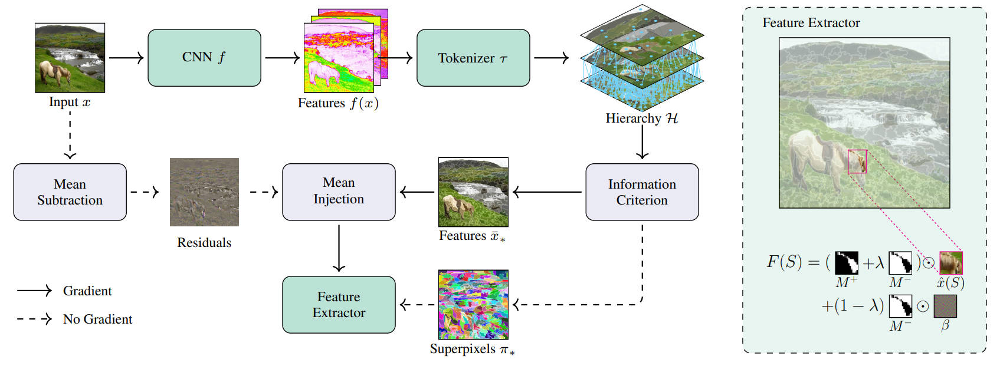

1.  **Feature Projection**: Projects each pixel into a learned feature space for subsequent grouping and similarity measurement.
2.  **Hierarchical Partitioning**: Builds a complete superpixel hierarchy by iteratively merging adjacent, similar regions.
3.  **Optimal Selection**: Uses an **Information Criterion (IC)** to select the optimal image partition from the hierarchy, balancing model fit and complexity.
4.  **Differentiable Feature Extraction**: Generates ViT-compatible Token features using a **Mean-Injection** mechanism, ensuring an end-to-end gradient flow.
